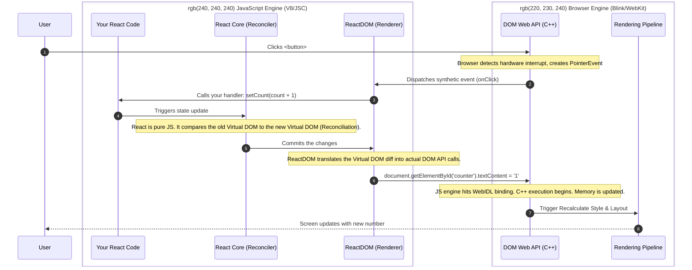

## Notes

1. Browser as OS/Runtime
2. API's are created in the language the browser is implemented in. C++ for Chrome inside Blink engin.
    - The web api engine and the JS engine (V8) are different.
    - Firefox, the engine is Gecko and parts of it is C++ and parts of it is Rust.
    - On ios, all browsers must call WebKit! - probably focus on this as notes
    - Mobile is complicated. API's often have to call os api's.
3. Notes about WASM but as a side note. Its not quite in place to natively talk to Web APIs. So still Javacsript.
    - Some are called by browser internally when rendering HTML which is declarative.
4. Examples are console.log, dom.something  session storage etc. 
    - Want to talk about websockets but probably too much info.
    - console.log, document.getElementById(), localStorage, and fetch(
5. There are web workers that can be used for offload tasks. Workers `do not` have access to all Web APIs.
    - For example document. etc is not available on worker.
6. Strong sandboxing. Not easy to access files directly from inside Chrome.

## Ref

MDN Web Docs - Introduction to Web APIs:
    *   Link: https://developer.mozilla.org/en-US/docs/Learn/JavaScript/Client-side_web_APIs/Introduction (https://developer.mozilla.org/en-US/docs/Learn/JavaScript/Client-side_web_APIs/Introduction)

## Diagrams

1. Engine split between JS and Runtime
2. React fn to web api sequence diagram
    - Note React is staying within V8 somehow?

### Diagram: React to Web API Execution Flow

